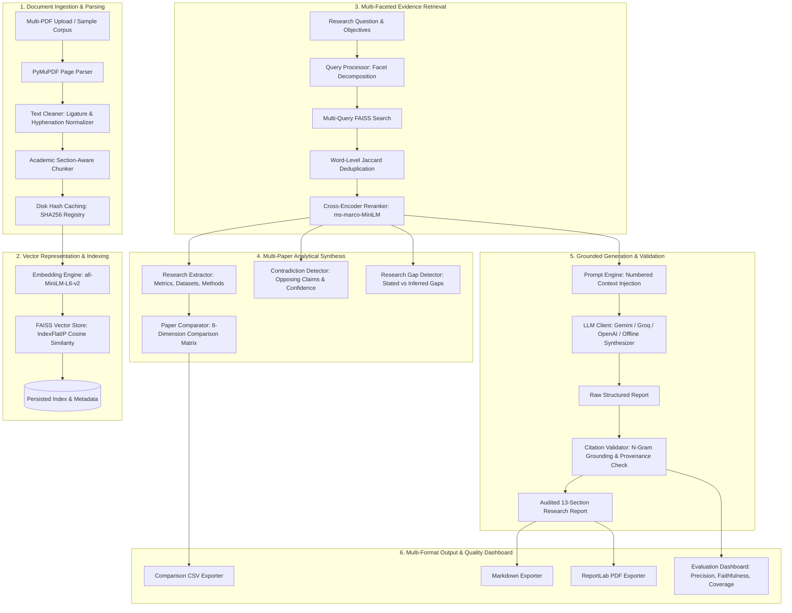

# ResearchRAG System Architecture

## 1. System Overview

**ResearchRAG** is an autonomous AI Research Report Generator powered by a multi-stage **Retrieval-Augmented Generation (RAG)** pipeline. The application is architected to perform deep cross-study synthesis, empirical comparison, contradiction detection, research gap identification, and strict grounded citation verification across academic literature.

---

## 2. Ingestion & Preprocessing Subsystem

### 2.1 PyMuPDF Parsing & Section Recognition
Academic PDFs feature multi-column layouts, mathematical notation, running headers, and footnote noise. The parser uses `fitz` (PyMuPDF) block-ordered extraction to preserve physical reading flow across columns.

- **Header / Footer Stripping**: Regex filters eliminate standalone pagination ("Page 1 of 12") and arXiv stamps (`arXiv:2301.xxxx`).
- **Ligature & Hyphenation Normalization**: Decomposes Unicode ligatures (`fi` -> `fi`) and rejoins line-split hyphenations (`transfor-\nmers` -> `transformers`).
- **Academic Section Boundary Detection**: Regex pattern matching identifies standard canonical sections: `Abstract`, `Introduction`, `Methodology`, `Experimental Setup`, `Results`, `Discussion`, `Limitations`, `Conclusion`, `References`.

### 2.2 Academic Section-Aware Recursive Chunking
Rather than applying arbitrary fixed-length windowing, `AcademicChunker` combines section hierarchy preservation with sentence-boundary recursive sliding windows:
- **Target Chunk Size**: 750 characters (~150-180 tokens).
- **Sliding Overlap**: 150 characters with word-boundary snapping.
- **Abbreviation Protection**: Prevents erroneous sentence splitting on common academic tokens (`et al.`, `e.g.`, `i.e.`, `Fig.`, `Eq.`, `vs.`).
- **Provenance Tagging**: Every chunk retains full metadata: `chunk_id`, `document_id`, `filename`, `page_number`, `section`, `char_start`, `char_end`, `token_count_est`, `sha256_hash`.

---

## 3. Retrieval & Indexing Subsystem

### 3.1 Dense Embedding Engine
- **Model**: `sentence-transformers/all-MiniLM-L6-v2` (384 dimensions).
- **Normalization**: Vectors are $L_2$-normalized to project onto unit hypersphere $S^{d-1}$, enabling inner product computation to equal exact Cosine Similarity:
  $$\text{CosineSimilarity}(\mathbf{u}, \mathbf{v}) = \mathbf{u} \cdot \mathbf{v} \quad (\text{for } \|\mathbf{u}\| = \|\mathbf{v}\| = 1)$$
- **Fallback Engine**: Local pseudo-dense TF-IDF / N-gram hashing vectorizer for air-gapped execution without external HuggingFace dependencies.

### 3.2 Vector Indexing (FAISS)
- **Index Type**: `faiss.IndexFlatIP` (Exact Inverted Index Inner Product).
- **Persistence**: Serialized `.faiss` vector binaries and `.json` chunk metadata stored in `data/processed/indices/`.

### 3.3 Multi-Aspect Query Decomposition
A monolithic query fails to retrieve balanced evidence across methodology, results, and limitations. `QueryProcessor` decomposes research queries into 4 canonical facets:
1. **Primary**: Original query
2. **Methodology**: Architecture, algorithm, mathematical formulation
3. **Results**: Empirical benchmarks, evaluation metrics, dataset scores
4. **Limitations**: Bottlenecks, failure modes, trade-offs

### 3.4 Deduplication & Cross-Encoder Reranking
1. **Deduplication**: Word-level Jaccard similarity filtering ($\theta = 0.85$) eliminates redundant passages from overlapping chunks.
2. **Cross-Encoder Reranking**: Uses `cross-encoder/ms-marco-MiniLM-L-6-v2` to score joint query-passage pairs $(q, p)$ via cross-attention, capturing deep relevance beyond bi-encoder vector projections.

---

## 4. Analytical Subsystem

### 4.1 Paper Comparison Matrix
Extracts 8 structured dimensions per paper:
- Problem Statement, Methodology/Architecture, Datasets Used, Metrics & Quantitative Results, Strengths, Limitations. Missing dimensions are filled with `"N/A / Not found in provided source"`.

### 4.2 Contradiction & Disagreement Detection
Evaluates cross-paper tensions on opposing technical paradigms:
- Dense vs Sparse retrieval superiority out-of-domain.
- Reranker accuracy vs inference latency trade-offs.
- Long-context LLMs vs RAG for factual grounding.

### 4.3 Research Gap Identification
Classifies gaps into:
- **Explicitly stated by authors**: Extracted directly from author limitation/future work sections.
- **Potential gap inferred from evidence**: Domain generalization bottlenecks, lack of standardized evaluation benchmarks, multi-hop reasoning deficits.

---

## 5. Generation & Citation Validation Subsystem

### 5.1 Modular LLM Provider Interface
Supports seamless runtime switching between:
- **Google Gemini**: `gemini-1.5-flash`
- **Groq**: `llama-3.1-8b-instant`
- **OpenAI**: `gpt-4o-mini`
- **Ollama**: Local models (`llama3`)
- **Deterministic Offline Synthesizer**: Extractive-abstractive hybrid synthesis engine producing fully cited reports without API keys.

### 5.2 Citation Grounding & Hallucination Audit
Before displaying the final report, `CitationValidator`:
1. Parses all in-text bracketed citations `[N]`.
2. Verifies that index $N$ maps to an ingested document and a valid page number.
3. Computes stopword-filtered token overlap and semantic alignment between the claim sentence and the source evidence chunk.
4. Calculates **Citation Validity Rate**, **Grounding Verification Score**, and **Hallucination/Unsupported Claim Rate**.

---

## 6. Multi-Format Export Engine
- **Markdown (`.md`)**: Full report with headers, bullet points, citations, and reference index.
- **PDF (`.pdf`)**: Formatted academic document rendered via ReportLab with clean typography, headers, footers, metadata banners, and styled reference lists.
- **CSV (`.csv`)**: Exportable Paper Comparison matrix and Evidence Ledger.
