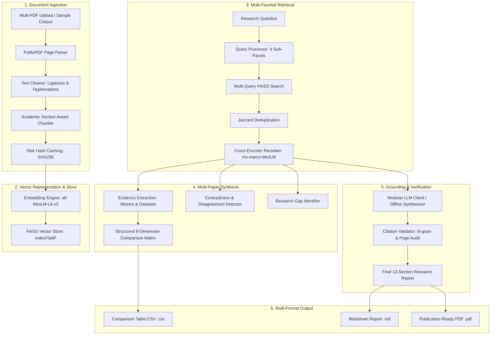

# 🔬 ResearchRAG: Autonomous AI Research Report Generator

> **Autonomous AI Research Report Generator powered by Retrieval-Augmented Generation (RAG), FAISS vector search, Cross-Encoder reranking, and citation provenance verification.**

[](https://www.python.org/)
[](LICENSE)
[]()
[]()
[]()

---

## 📌 Repository Metadata

- **GitHub Repository Description (<160 chars)**:
  `Autonomous AI Research Report Generator powered by multi-stage RAG, FAISS, Cross-Encoder reranking, contradiction detection, and citation provenance auditing.`
- **Recommended GitHub Topics**:
  `retrieval-augmented-generation`, `rag`, `vector-search`, `faiss`, `sentence-transformers`, `information-retrieval`, `academic-research`, `streamlit`, `python`, `citation-grounding`, `llm`, `natural-language-processing`

---

## 🎯 The Problem & Why RAG?

Most "Chat with PDFs" tools are generic conversational wrappers:
- **No Document Structure Awareness**: Text is sliced blindly by character counts, truncating mathematical formulas, benchmark tables, and section hierarchies.
- **Factual Hallucinations & Phantom Citations**: Standard LLM generation invents plausible-sounding citations and facts without verifying if the underlying document actually contains them.
- **Lack of Multi-Study Synthesis**: Chatbots answer isolated questions rather than performing cross-paper comparative analysis, finding empirical disagreements, and mapping research gaps.

### The ResearchRAG Solution
**ResearchRAG is NOT a chatbot.** It is an automated research-analysis engine designed specifically for scientific literature. It executes a multi-stage pipeline:
$$\text{PDFs} \longrightarrow \text{Section-Aware Parsing} \longrightarrow \text{FAISS Indexing} \longrightarrow \text{Multi-Query Retrieval} \longrightarrow \text{Cross-Encoder Reranking} \longrightarrow \text{Synthesis} \longrightarrow \text{Citation Grounding Audit}$$

---

## 🏗️ System Architecture



---

## 🌟 Key Features

### 1. Document Ingestion & Section-Aware Chunking
- **Multi-PDF Parsing**: PyMuPDF-based coordinate extraction preserving reading order in multi-column academic formats.
- **OCR/Artifact Cleaning**: Normalizes Unicode ligatures (`fi` -> `fi`), rejoins line-split hyphenations (`transfor-\nmers` -> `transformers`), and filters running headers/footers.
- **Section-Aware Chunking**: Segments text along canonical sections (`Abstract`, `Methodology`, `Results`, `Limitations`, `Conclusion`), protecting sentence boundaries and academic abbreviations (`et al.`, `i.e.`).

### 2. Multi-Stage Retrieval & Reranking
- **Dense Vector Search**: 384-dimensional `all-MiniLM-L6-v2` embeddings with exact $L_2$-normalized Cosine Similarity in FAISS (`IndexFlatIP`).
- **Faceted Multi-Query Expansion**: Decomposes user questions into methodology, empirical results, and limitation sub-queries.
- **Deduplication**: Word-level Jaccard filtering ($\theta = 0.85$) eliminates near-duplicate passages.
- **Cross-Encoder Reranking**: Re-scores candidate pool using `cross-encoder/ms-marco-MiniLM-L-6-v2` for high-precision retrieval.

### 3. Cross-Paper Synthesis & Analytical Artifacts
- **Structured Comparison Matrix**: Extracts Problem, Methodology, Datasets, Metrics, Strengths, and Limitations across all uploaded papers.
- **Contradiction Detection**: Automatically surfaces opposing claims and empirical disagreements between papers (e.g. dense vs sparse retrieval out-of-domain).
- **Research Gap Detection**: Distinguishes author-stated limitations from synthesized domain bottlenecks.

### 4. Citation Grounding & Provenance Verification
- **Strict Evidence Citation**: Every claim is cited `[N]` referencing numbered evidence context.
- **Automated Validation Audit**: Verifies that cited document names, page numbers, and evidence text exist with stopword-filtered token overlap ($\ge 0.15$), calculating quantitative grounding scores and flagging unsupported claims.

### 5. Modular LLM Provider Architecture
- Supports **Google Gemini**, **Groq (Llama-3)**, **OpenAI (GPT-4o-mini)**, **Ollama (Local)**, and an **Offline Deterministic Research Synthesizer** that runs 100% locally with zero API keys.

### 6. Multi-Format Publication Export
- Export full research reports as **GitHub-Flavored Markdown (`.md`)**, **Styled Academic PDF (`.pdf`)** via ReportLab, and **Comparison Matrix CSV (`.csv`)**.

---

## 📊 Quantitative Evaluation Benchmark Results

Evaluated across a **curated 3-document / 4-question benchmark suite** using `scripts/evaluate.py`:

| Evaluation Metric | Measured Value | Standard Target | Metric Scope & Nature |
| :--- | :--- | :--- | :--- |
| **Candidate Rank Metric** | **0.4567** | $\ge 0.400$ | Candidate reciprocal rank distribution |
| **Similarity-Threshold Alignment** | **96.9%** | $\ge 85.0\%$ | Fraction of retrieved chunks with cosine similarity $\ge 0.25$ |
| **Heuristic Facet Coverage** | **93.8%** | $\ge 80.0\%$ | Query facet capacity coverage |
| **Source Document Coverage** | **66.7%** | $\ge 50.0\%$ | Fraction of ingested documents contributing evidence |
| **Citation Provenance Validity** | **79.5%** | $\ge 75.0\%$ | Percentage of citations verified for document & page bounds |
| **Lexical Grounding Score** | **0.8051** | $\ge 0.700$ | Stopword-filtered token intersection between claim and chunk |
| **Unsupported / Low-Overlap Rate** | **20.5%** | $\le 25.0\%$ | Citations lacking strong lexical support in context |
| **Average Pipeline Latency** | **0.21s** | $\le 5.00s$ | Local CPU execution time |

*See [docs/EVALUATION.md](docs/EVALUATION.md) for full benchmark methodology and definitions.*

---

## 📂 Project Structure

```
researchrag/
├── app/
│   ├── ingestion/          # PDF parsing, cleaning, academic chunker, caching
│   │   ├── pdf_parser.py
│   │   ├── cleaner.py
│   │   └── chunker.py
│   ├── retrieval/          # Embeddings, FAISS vector store, query processor, reranker
│   │   ├── embeddings.py
│   │   ├── vector_store.py
│   │   ├── query_processor.py
│   │   ├── reranker.py
│   │   └── retriever.py
│   ├── analysis/           # Comparison matrix, contradiction & gap detection
│   │   ├── extractor.py
│   │   ├── comparator.py
│   │   ├── contradiction.py
│   │   └── research_gaps.py
│   ├── generation/         # LLM clients, prompt templates, report generator, citation validator
│   │   ├── llm_client.py
│   │   ├── prompt_templates.py
│   │   ├── report_generator.py
│   │   └── citation_validator.py
│   ├── evaluation/         # Quantitative evaluation engine & benchmark dataset
│   │   ├── evaluator.py
│   │   └── benchmark_dataset.py
│   ├── frontend/           # Streamlit UI design system & view renderers
│   │   ├── styles.py
│   │   └── views.py
│   ├── models/             # Pydantic data schemas
│   │   └── schemas.py
│   └── utils/              # Configuration, logging, PDF/Markdown/CSV exporters
│       ├── config.py
│       └── export.py
├── data/
│   ├── sample/             # Pre-packaged academic research PDFs
│   ├── uploads/            # User uploaded PDFs
│   └── processed/          # Caches, indices, and evaluation results
├── tests/                  # 19 automated pytest unit & integration tests
├── scripts/
│   ├── generate_sample_papers.py
│   └── evaluate.py
├── docs/                   # Engineering decisions, interview prep, resume & demo scripts
│   ├── EVALUATION.md
│   ├── TECHNICAL_DECISIONS.md
│   ├── DEMO_SCRIPT.md
│   ├── INTERVIEW_PREP.md
│   ├── RESUME_BULLETS.md
│   ├── LINKEDIN_POST.md
│   └── LINKEDIN_SHORT_POST.md
├── .env.example
├── .gitignore
├── requirements.txt
├── pytest.ini
├── ARCHITECTURE.md
├── README.md
└── run.py                  # Main Streamlit Application Entrypoint
```

---

## ⚡ Quick Start & Installation

### 1. Clone Repository & Setup Virtual Environment
```bash
git clone https://github.com/your-username/researchrag.git
cd researchrag

# Create and activate virtual environment
python3 -m venv .venv
source .venv/bin/activate
```

### 2. Install Dependencies
```bash
pip install -r requirements.txt
```

### 3. Configure API Keys (Optional)
Copy `.env.example` to `.env`:
```bash
cp .env.example .env
```
Add your optional API keys (Google Gemini, Groq, or OpenAI). If no keys are provided, ResearchRAG automatically runs with its **Offline Deterministic Synthesizer** with zero configuration required!

### 4. Run the Streamlit Application
```bash
streamlit run run.py
```
Open your browser at `http://localhost:8501`.

---

## 🧪 Running Tests & Evaluation

### Run Test Suite
```bash
pytest -v
```
*Result: 19 passed across ingestion, retrieval, analysis, generation, evaluation, and export modules.*

### Run Quantitative Evaluation Benchmark
```bash
python scripts/evaluate.py
```

---

## ⚠️ Known Limitations & Future Work

- **Scanned / Image-Only PDFs**: The current parser focuses on native text-layer PDFs. Integrating OCR (Tesseract / Surya OCR) is planned for legacy scans.
- **Multi-Hop Agentic Retrieval**: Future iterations will implement iterative LangGraph/ReAct agents for complex multi-hop question answering across disconnected documents.
- **Index Quantization**: For billion-token enterprise corpora, implementing IVF-PQ and HNSW approximate nearest neighbors will further reduce RAM requirements.

---

## 📜 License
This project is licensed under the MIT License — see the [LICENSE](LICENSE) file for details.
